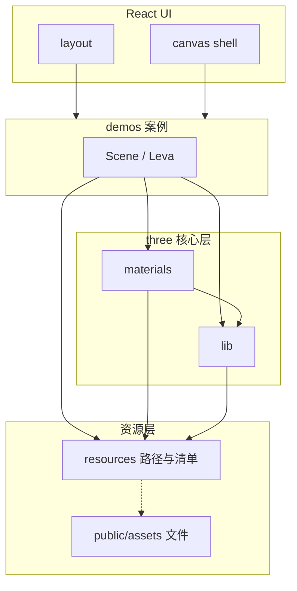

# Three.js 案例展示站 — 开发计划

## 1. 目标与范围

构建一个**可扩展的多案例 Three.js 展示站点**：每个案例独立、可切换浏览，并支持在开发/演示阶段用可视化面板调节参数，验证渲染与交互能力。

**不在首版必须完成的内容**（可后续迭代）：用户账号、后端持久化、复杂 CMS。

---

## 2. 技术选型

| 层级 | 技术 | 说明 |
|------|------|------|
| 框架 | React 18+ | 组件化组织案例与布局 |
| 3D | Three.js + **@react-three/fiber** | 声明式场景图，与 React 生命周期对齐 |
| 辅助 | **@react-three/drei** | 常用抽象（OrbitControls、Environment、Html 等） |
| 语言 | TypeScript | 案例元数据、路由与 props 类型安全 |
| 样式 | Tailwind CSS | 外壳 UI（导航、侧栏、说明区），与 Canvas 分离 |
| 调试/调节 | **Leva** | 案例中暴露 `useControls`，便于调参、录屏前微调 |

> 若「leve」指**难度分级**（初级/中级/高级），可在案例元数据中增加 `level` 字段，列表页按标签筛选即可，与 Leva 不冲突。

---

## 3. 目录结构、资源与解耦

### 3.1 推荐目录结构（按分层拆分）

```
public/
  assets/                 # 外部静态资源根（大文件放这里，构建不经过打包器压缩逻辑时可走 URL）
    textures/             # 贴图（jpg/png/webp/ktx2 等）
    models/               # glTF / GLB / FBX 等
    env/                  # HDR / EXR 环境贴图
    audio/                # 若有声音案例
    fonts/                # 若有 MSDF / 字体文件

src/
  app/                    # 或 pages/，视路由方案而定
  components/
    layout/               # 顶栏、侧栏、案例外壳（仅 UI）
    canvas/               # 通用 Canvas 容器（dpr、Suspense、错误边界）
  resources/              # 【外部资源层】仅路径、清单、类型，不放 Three 对象
    paths.ts              # 统一导出 BASE_URL + 相对路径常量（避免案例内散落字符串）
    manifest.ts           # 可选：按 id 登记资源元数据（用途、格式、是否预加载）
    types.ts              # 资源描述类型（AssetId、TextureRef 等）
  three/                  # 【Three 相关非 UI】与 React 案例解耦的纯逻辑
    lib/                  # 【公用方法】纯函数、工具、与具体 demo 无关
      dispose.ts          # 释放 Object3D / 材质 / 纹理
      loaders.ts          # 封装 TextureLoader、DRACOLoader、KTX2Loader 等（可选）
      math.ts             # 向量、缓动、通用数值
      constants.ts        # 渲染层常量（如默认 toneMapping，非业务魔法数）
    materials/            # 【材质层】工厂函数 / 预设 / 参数类型，不绑定某一案例 Scene
      presets/            # 如 glass.ts、pbrStandard.ts、toon.ts
      createMaterial.ts   # 统一入口或 re-export
      types.ts            # 材质构建参数类型
    hooks/                # 可选：仅当 hook 被多个案例复用且与 Three 强相关时放这里
  demos/                  # 【案例层】只编排场景与交互，不定义「全局资源路径」与「可复用材质实现」
    _registry.ts
    example-basic/
      Scene.tsx           # 组合几何体 + 引用 materials / resources
      index.tsx
  hooks/                  # 与 DOM、路由、通用 React 相关（非 Three 专用）
  styles/
docs/
  development-plan.md
```

原则：

- **页面壳**：DOM + Tailwind；**3D**：仅在 `<Canvas>` 子树内。
- **外部资源文件**只放在 `public/assets/`（或经构建的 `src/assets` 小资源），**路径与清单**集中在 `src/resources/`，案例内不写裸 URL 字符串。
- **材质定义**集中在 `src/three/materials/`，案例通过函数或预设引用，避免在 `Scene.tsx` 内堆 `new MeshStandardMaterial({...})` 作为可复用逻辑。
- **公用方法**集中在 `src/three/lib/`（及必要时 `src/hooks/`），**禁止**从 `lib` / `materials` / `resources` **反向 import** 任一 `demos/**` 文件。

### 3.2 外部资源层（`resources/` + `public/assets/`）

| 做法 | 说明 |
|------|------|
| 二进制文件 | 放 `public/assets/**`，通过 `paths.ts` 拼出 `import.meta.env.BASE_URL` 下的稳定 URL。 |
| 不在案例里硬编码 | 案例只引用 `paths.env.main`、`paths.models.foo` 等常量或 `manifest` 中的 id。 |
| 预加载策略 | 可选：在 `manifest` 标注 `preload`，由全局 `Canvas` 或路由层统一 `useLoader` / 队列加载，避免每个案例各写一套。 |
| 与材质解耦 | 资源层只描述「文件在哪、什么类型」；**不把** `Texture` / `DataTexture` 的创建细节写在 `paths.ts`，创建放在 `three/lib/loaders.ts` 或案例内 `useLoader`，避免循环依赖。 |

### 3.3 材质层（`three/materials/`）

| 做法 | 说明 |
|------|------|
| 工厂函数 | 如 `createPbrMaterial(params)` 返回配置好的 `MeshStandardMaterial` 或 `ShaderMaterial`，参数用 TypeScript 类型约束。 |
| 预设 | 按名称或主题分文件（`presets/glass.ts`），案例 `import { glassPreset }` 再微调。 |
| 与资源衔接 | 材质工厂**可接收**已加载的 `Texture`，或由工厂内部调用 `lib/loaders`（保持单向：`materials` → `lib`，不依赖 `demos`）。 |
| 禁止 | 不要在 `materials/` 里引用 `demos/*` 或 Leva 控件；调试参数由案例传入 **plain 对象**即可。 |

### 3.4 公用方法层（`three/lib/`）

适合放入的内容示例：

- 递归 `dispose`、纹理释放、几何体复用判断。
- Loader 封装、缓存 key（同一 URL 不重复加载）。
- 与业务无关的向量/矩阵辅助、动画插值。
- 后处理链组装（若多案例共用，可再抽 `three/lib/postprocessing.ts`）。

不适合放入 `demos` 内复制粘贴的「第二次用到的逻辑」应上浮到 `lib` 或 `materials`。

### 3.5 依赖方向（解耦总览）



**硬性约定**：

1. `demos` → 可依赖 `components`、`three/materials`、`three/lib`、`resources`。  
2. `three/materials` → 可依赖 `three/lib`、`resources`（仅类型或路径，不创建对单案例的耦合）。  
3. `three/lib` → 可依赖 `resources`（路径）、`three` 包本身；**不可**依赖 `materials`（避免与材质层循环）；若某工具仅为材质服务，可放在 `materials/` 下的 `internal` 子模块。  
4. `resources` → **仅**常量、类型、清单；**不** import `three`（保持纯配置层，便于单元测试与 Tree-shaking 心智）。  

---


## 4. 分阶段实施

### 阶段 A：工程脚手架（约 0.5–1 天）

- 使用 Vite + React + TypeScript 初始化项目。
- 接入 Tailwind CSS（`content` 覆盖 `src`）。
- 安装：`three`、`@react-three/fiber`、`@react-three/drei`、`leva`。
- 配置路径别名（如 `@/` → `src/`），ESLint + Prettier（可选）。

### 阶段 B：布局与案例路由（约 1 天）

- 实现**主布局**：左侧或顶部**案例列表**，右侧**说明 + Canvas 区域**。
- **案例注册表** `_registry.ts`：统一 `id`、`title`、`description`、`component`（`React.lazy`）。
- 路由：`/demo/:demoId` 或查询参数 `?demo=xxx`，切换时卸载上一个 Canvas 内场景，避免 WebGL 上下文堆积。
- 为 Canvas 加 **Suspense** 与简单 **ErrorBoundary**，加载/报错有明确 UI。

### 阶段 C：第一个标杆案例 + Leva（约 0.5–1 天）

- 实现一个最小案例（例如旋转立方体 + 环境光/平行光 + OrbitControls）。
- 用 **Leva** 暴露：`color`、`rotationSpeed`、`metalness` 等，验证「调节 → 实时预览」流程。
- 约定案例内部模式：默认 `Scene` 纯展示，Leva 仅在 `import.meta.env.DEV` 或 URL `?debug=1` 时挂载，避免生产环境面板干扰（可按团队偏好二选一）。

### 阶段 D：规模化案例（持续）

- 每新增案例：在 `demos/` 下新建文件夹 + 在 `_registry.ts` 注册一条。
- 可选字段：`tags`、`level`、`thumbnail`（静态图或 `canvas.toDataURL` 截图脚本）。
- **解耦检查**：新案例若引入新贴图/模型，先归入 `public/assets/**` 并在 `resources/paths.ts`（或 `manifest`）登记；可复用材质进 `three/materials/`；第二次出现的工具函数进 `three/lib/`。
- 与 Canvas 强相关但**非 Three 内核**的壳层能力（如统一包裹 `Stats`、`PerformanceMonitor`）放在 `components/canvas/`，与 `three/lib` 区分：前者偏 React 组合，后者偏无 UI 的纯逻辑。

### 阶段 E：质量与体验（穿插进行）

- **性能**：限制 `dpr`、大场景用 `instancing`、按需加载纹理；加载与缓存逻辑集中在 `three/lib/loaders`，避免各案例重复实现。
- **可访问性**：外壳文案、键盘焦点；Canvas 区域提供文字说明替代纯图形信息（视需求）。
- **构建**：生产构建体积分析，Three 按需 import（避免整包 `THREE`）。

---

## 5. 风险与注意点

- **多案例切换**：务必在路由变化时清理几何体/材质/纹理引用，或整页卸载 `<Canvas>`，防止内存泄漏；释放逻辑优先复用 `three/lib/dispose` 中的统一实现，避免各案例写法不一致。
- **Leva 与 R3F**：Leva 面板在 DOM 层，Canvas 在另一层；调节状态建议放在案例组件 state 或 `useControls` 返回值上，再传入 R3F 子组件；**勿在 `materials/` 内直接依赖 Leva**，保持材质层可单测、可复用。
- **Tailwind 与 Canvas**：3D 内文字可用 `@react-three/drei` 的 `<Html>`，样式可用内联或 CSS Module，与全局 Tailwind 类混用需有心理预期（隔离性）。
- **循环依赖**：`lib` ↔ `materials` 之间只保留单向依赖（见 3.5）；一旦出现「材质里要调只存在于某 demo 的常量」，应将该常量上提到 `resources` 或 `lib/constants`。
- **资源与材质混淆**：贴图 URL 不放材质文件顶部作为「唯一真相」；以 `resources` 为真相来源，材质只消费「已解析的 Texture 或参数对象」。

---

## 6. 验收标准（MVP）

- [ ] 本地 `pnpm dev` / `npm run dev` 可运行。
- [ ] 至少 **2 个**独立案例可从列表切换，无控制台严重报错。
- [ ] 至少 **1 个**案例集成 Leva，参数变化可实时反映到画面。
- [ ] 外壳布局使用 Tailwind，结构清晰，便于继续加案例。
- [ ] 已建立 `public/assets/`、`src/resources/`、`src/three/lib/`、`src/three/materials/` 的**物理目录**；至少 **1 个**案例通过 `resources` 引用资源、通过 `materials` 或预设创建材质，无在 `demos` 内硬编码长 URL 链。
- [ ] `three/lib` 中至少 **1 个**可复用工具（如 `dispose` 或 loader 封装）被多个模块或案例使用，体现解耦。

---

## 7. 建议的下一步（落地顺序）

1. 在本仓库执行 Vite 初始化并安装上述依赖。  
2. **先搭分层空目录**：`public/assets/` 子目录、`src/resources/paths.ts`、`src/three/lib/`、`src/three/materials/presets/`，并在 README 或本文档中贴 3.5 依赖图供团队对齐。  
3. 实现 `Layout` + `DemoCanvas` + `_registry` + 第一个案例（强制走 `paths` + 至少一个 `materials` 工厂）。  
4. 复制第一个案例为模板，添加第二个案例（验证注册表与路由及 `lib` 复用）。  
5. 根据实际需要补充 `level`/`tags` 筛选与「案例编写规范」（何时上浮到 `materials`/`lib`/`resources`）。

---

## 8. 变更记录

| 日期 | 说明 |
|------|------|
| 初版 | 目标、技术栈、基础目录与阶段划分。 |
| 修订 | 增加资源 / 材质 / 公用方法分层，`resources` 与 `public/assets` 分离，依赖方向与 MVP 验收补充。 |
